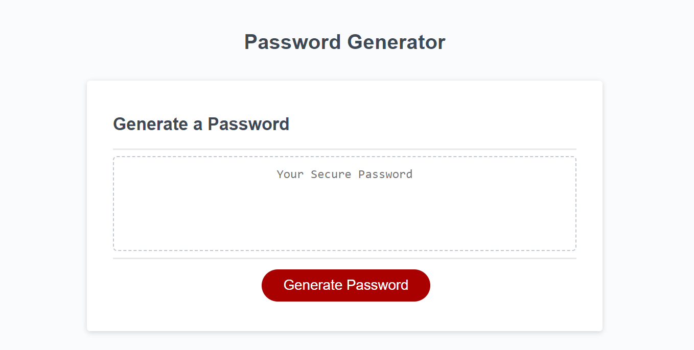
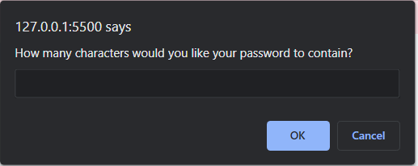
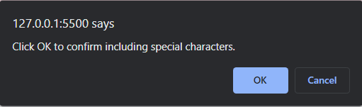
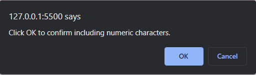
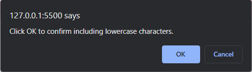
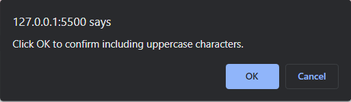
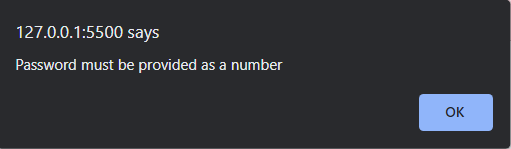
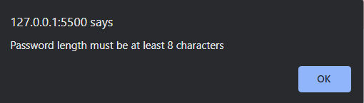
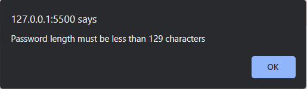

# Random Password Generator

## Description
The Random Password Generator is a website where users can decide the parameters of a password, and obtain a password that is uniquely generated just for them. This website utilizes Javascript objects and functions to create a randomized password each time of use. The alerts allow for the user to decide what length, and what characters they would like the password to have. 

## Installation
The website can be accessed on any browser by inputting the URL for the deployed site into the address bar. Once on the page, they will either input or answer "OK" or "Cancel" to the alerts. 

## Usage
Once the website can be accessed through the deployed site URL, the user will need to navigate over the red "Generate Password" button at the bottom of the text box. 
1. Click "Generate Password"

2. Input a number between 8 and 128 to determine how many characters long you would like the password to be

3. Select "ok" or "cancel" for whether or not you would like special characters in the password. 

4. Select "ok" or "cancel" for whether or not you would like numeric characters in the password. 

5. Select "ok" or "cancel" for whether or not you would like lowercase characters in the password. 

6. Select "ok" or "cancel" for whether or not you would like uppercase characters in the password. 

7. See your randomly generated password in the textbox. This can be copied to your clipboard to be used as needed. 

Please note that if there is a non-numeric entry placed in the alert box for how many characters long you want the password to be, then the alert message will display the following message: 

There will be a similar message is the number placed in the alert box for this prompt is less then 8, this message will show: 

If the number entered is more than 129: 

## Credits
N/A

## License
N/A